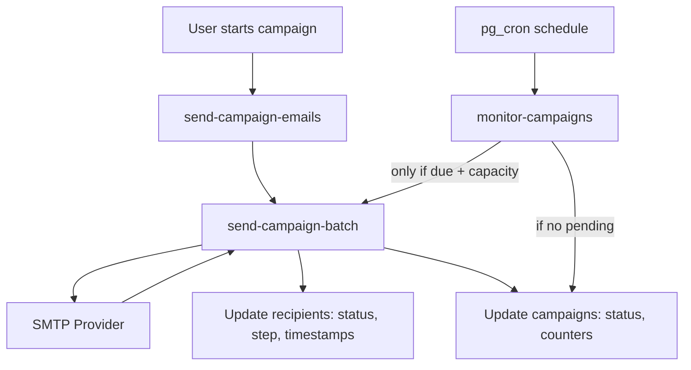

# Campaign Email Flow: Optimized Today, Production-Ready Tomorrow

This document describes the **current optimized flow**, the **target production architecture**, and the exact control points that prevent unnecessary Edge Function invocations while preserving all sending logic and tracking features.

---

## Goals

1) **Only send when due** (respect delays, daily limits, follow-up timing).
2) **No wasteful Edge Function calls** (avoid "no recipients found" loops).
3) **Production-grade safety** (idempotency, locking, retries, observability).
4) **Maintain all existing features** (multi-sender, tracking, follow-ups, reply checks).

---

## Components in This Repo

Edge functions (Supabase):
- `send-campaign-emails` - marks campaigns as sending and triggers initial batch.
- `monitor-campaigns` - orchestration worker (cron-driven).
- `send-campaign-batch` - sends emails, updates recipients/campaigns.
- `track-email-open` - tracking pixel.
- `track-email-click` - click tracking + ghost-link bot detection.
- `check-email-replies` - polls IMAP/DB for replies and bounces.
- `sync-mailbox` - manual mailbox sync for in-app inbox.

Database cron jobs (pg_cron) defined in migrations:
- `monitor-campaigns-worker` - invokes `monitor-campaigns`.
- `campaign-monitor` - safety net (invokes `monitor_and_restart_campaigns`).
- `check-replies-bounces` - invokes `check-email-replies`.
- Historical jobs like `trigger-email-batches` exist in old migrations and must be removed if still present.

---

## Current Optimized Flow (Implemented)

Key change: **`monitor-campaigns` now calls `send-campaign-batch` only when there are due recipients AND remaining daily capacity**. It also marks a campaign `sent` when there are no pending recipients left.



### What the orchestrator now checks

Before calling `send-campaign-batch`, `monitor-campaigns` checks:
- **Due recipient count** (step 0 or follow-ups).
- **Daily limit capacity** (step0 vs follow-ups split).
- **Send delay elapsed** (for step 0).
- **Pending count** (if 0, mark campaign `sent`).

This removes the repeated “No recipients found” invocations and stops calls when daily limit is already exhausted.

---

## Why Calls Were Exploding (Root Causes)

1) **Cron baseline**  
Every minute = 1,440 calls/day for a single worker.

2) **Fan-out per campaign + step + sender config**  
Prior flow invoked `send-campaign-batch` for every step and sender on every run, even when no recipients were due.

3) **Overlapping schedulers**  
Multiple cron jobs (`monitor-campaigns-worker`, `campaign-monitor`, `trigger-email-batches`) can stack.

4) **Frontend auto-restarts**  
`useRealtimeCampaigns` periodically invokes `send-campaign-emails` without needing to.

5) **Tracking calls are unrelated to sending limits**  
Opens/clicks are new Edge Function invocations, often triggered by bot scanners.

---

## Production-Grade Target Architecture (Queue-Driven)

This is the long-term architecture to **fully eliminate wasted invocations** and scale safely.

```mermaid
flowchart TD
  Scheduler[cron every N mins] --> Enqueue[enqueue_due_sends()]
  Enqueue --> Queue[(send_queue table)]
  Worker[send-worker edge function] -->|claim rows SKIP LOCKED| Queue
  Worker --> SMTP[SMTP Provider]
  Worker --> DB1[Update recipients + campaigns]
  Worker --> Queue2[enqueue follow-ups with run_at]

  EmailClient --> Open[track-email-open] --> DBTrack
  EmailClient --> Click[track-email-click] --> DBTrack
  Cron2[check-replies-bounces] --> Replies[check-email-replies] --> DBReply
```

### Queue model (table example)
Each row represents **one sendable unit**:
- `campaign_id`
- `recipient_id`
- `step`
- `sender_config_id`
- `run_at`
- `status` (`pending`, `processing`, `sent`, `failed`)
- `attempts`, `last_error`

Workers do:
- `SELECT ... FOR UPDATE SKIP LOCKED` for due rows.
- Send, then mark completed.
- Enqueue next follow-up (with delay) if applicable.

---

## Current System: Detailed Behavior (Production-Safe)

### Step 0 (Initial Email)
- **Delay enforced** by `send_delay_minutes` and `last_sent_at`.
- **Batch size = 1** to preserve exact delay spacing.
- **Daily limits enforced** per sender config.
- **Pending = 0** => campaign marked `sent` in the monitor.

### Follow-ups
- Triggered only if:
  - recipient has `status = sent`
  - `current_step = step - 1`
  - follow-up delay has elapsed
  - no reply
  - capacity remains
- **Batch size up to 10** for efficiency (can be tuned).

### Multi-sender
- Per sender config capacity enforced in both monitor + batch.
- `assigned_email_config_id` allows per-sender distribution.

---

## Rate Controls & Limits

### Daily Limits
We split daily limit by step:
- **Step 0 = 50%** of daily limit (minimum 1).
- **Follow-ups = remaining 50%**.
This keeps new outreach going without starving follow-ups.

### Send Delay
Delay enforced at **scheduler level** (monitor) and **batch level** (last_sent_at in configs).

### Cold Start / No Recipients
`monitor-campaigns` now **skips batch invocation** if:
- due count is 0
- or remaining capacity is 0
This eliminates waste invocations.

---

## Tracking & Replies (Separate Load Path)

Tracking calls are **not bounded by daily send limits**.
Even with perfect batching, opens/clicks can be high due to scanners and prefetching.

Ways to reduce:
- Remove ghost link (lower bot noise, less detection).
- Add WAF rules for known scanners.
- Move tracking to a lower-cost endpoint if needed.

---

## Request Volume Estimation

### monitor-campaigns baseline
```
Invocations/day = cron_runs_per_day
1 minute  -> 1440/day
2 minutes -> 720/day
5 minutes -> 288/day
```

### send-campaign-batch (after optimization)
```
Step 0: ~1 call per email sent (batchSize=1)
Follow-ups: ceil(due_followups / batchSize) per step per sender config
Only when due + capacity > 0
```

### Total
```
Total = monitor-campaigns + send-campaign-batch + tracking + replies
```

---

## Production Safety Checklist

- Use **one** orchestrator (monitor-campaigns or queue worker).
- Remove redundant cron jobs (`trigger-email-batches` etc).
- Remove frontend auto-restarts unless strictly manual.
- Enforce **idempotent recipient locks** (`status=processing` + timestamps).
- Track failure counts and retry with exponential backoff.
- Add alerts for:
  - stuck recipients
  - repeated batch errors
  - sudden spikes in tracking

---

## Migration Plan (Safe & Incremental)

Phase 1 (today, minimal risk):
- Keep only `monitor-campaigns-worker`.
- Remove old cron jobs and frontend auto restarts.
- Verify `monitor-campaigns` gating (due + capacity + pending check).

Phase 2 (queue-based):
- Add `send_queue` table.
- Build `enqueue_due_sends()` DB function.
- Build `send-worker` edge function using SKIP LOCKED.
- Flip scheduler to enqueue + worker.

Phase 3 (hardening):
- Add dead-letter queue for failures.
- Add per-sender throttling (rate/minute).
- Add metrics dashboards (send success, bounce, reply rates).

---

## Key Files

- `supabase/functions/monitor-campaigns/index.ts`
- `supabase/functions/send-campaign-batch/index.ts`
- `supabase/functions/send-campaign-emails/index.ts`
- `supabase/functions/track-email-open/index.ts`
- `supabase/functions/track-email-click/index.ts`
- `supabase/functions/check-email-replies/index.ts`
- `supabase/migrations/*.sql`

