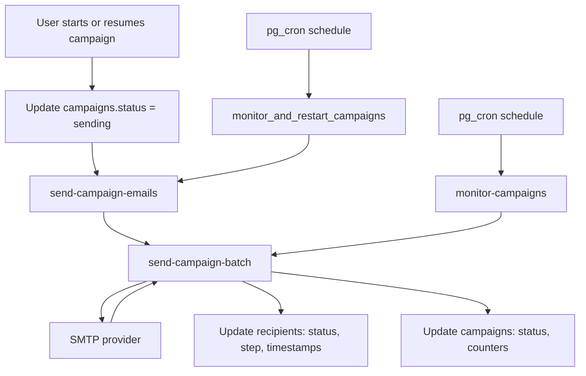
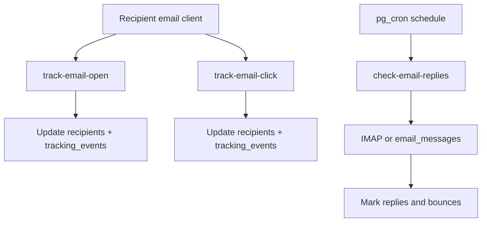

# Campaign Email Flow and Edge Function Usage

This document explains the end-to-end campaign sending flow, why edge function calls can be much higher than daily send limits, and how to reduce the call volume without breaking delivery.

## Components in This Repo

Edge functions (Supabase):
- `send-campaign-emails` - wrapper to mark campaigns as sending and trigger first batch.
- `monitor-campaigns` - periodic worker that triggers batches for step 0 and follow-ups.
- `send-campaign-batch` - sends emails (SMTP), updates recipients and campaign stats.
- `track-email-open` - tracking pixel for opens.
- `track-email-click` - tracking redirects for clicks (includes ghost link detection).
- `check-email-replies` - polls IMAP or DB to mark replies and bounces.
- `sync-mailbox` - manual mailbox sync for the in-app inbox.

Database cron jobs (pg_cron) defined in migrations:
- `campaign-monitor` - calls `monitor_and_restart_campaigns()` which can invoke `send-campaign-emails`.
- `trigger-email-batches` - calls `trigger_next_batch()` which invokes `send-campaign-batch`.
- `monitor-campaigns-worker` - calls the `monitor-campaigns` edge function.
- `check-replies-bounces` - calls the `check-email-replies` edge function.

See:
- `supabase/functions/monitor-campaigns/index.ts`
- `supabase/functions/send-campaign-batch/index.ts`
- `supabase/functions/send-campaign-emails/index.ts`
- `supabase/functions/track-email-open/index.ts`
- `supabase/functions/track-email-click/index.ts`
- `supabase/functions/check-email-replies/index.ts`
- `supabase/migrations/*.sql`

## End-to-End Flow (Campaign Sending)



Notes:
- `monitor-campaigns` currently invokes `send-campaign-batch` for follow-up steps on every run, then decides if step 0 is due.
- `send-campaign-batch` handles delays, daily limits, and recipient locking before sending.

## Tracking and Replies (Separate Flow)



## Why 31k Edge Function Calls Per Day (Even With 400 Sends)

1) Cron frequency adds a baseline
- A job that runs every minute = 1,440 calls/day.
- Every 2 minutes = 720 calls/day.
- Multiple cron jobs stack (monitor + trigger + reply checks).

2) `monitor-campaigns` fan-out
- For each run it can invoke `send-campaign-batch` for every follow-up step and for each sender config.
- Example fan-out:
  - 5 active campaigns
  - 3 follow-up steps
  - 2 sender configs
  - 1 run/minute
  - 5 * 3 * 2 * 1,440 = 43,200 batch calls/day

3) Tracking calls are separate from send limits
- Every open and click is a new edge function call.
- Security scanners and mailbox providers prefetch links and images.
- Ghost links also get clicked by bots, which still hit the function.

4) Multiple schedulers can overlap
- There are migrations that schedule `monitor-campaigns-worker`, `campaign-monitor`, and `trigger-email-batches`.
- If older jobs were not fully unscheduled, they can all run at once.

## Fixes That Reduce Call Volume

Quick wins (no major refactors):
1) Keep only one scheduler path.
   - Pick `monitor-campaigns` OR `trigger_next_batch` OR `monitor_and_restart_campaigns`.
   - Unschedule the others so only one worker invokes batch sending.

2) Reduce schedule frequency.
   - If your minimum send delay is 5+ minutes, do not run every minute.
   - Match cron cadence to `send_delay_minutes` (ex: every 5 or 10 minutes).

3) Only invoke follow-up batches when due.
   - In `monitor-campaigns`, add a due check before invoking `send-campaign-batch` for each step.
   - If no recipients are eligible, skip the call.

4) Remove redundant front-end restarts.
   - `useRealtimeCampaigns` calls `send-campaign-emails` on app load and every 5 minutes.
   - If backend cron is reliable, remove the interval or make it manual only.

5) Reduce tracking calls if you can accept lower fidelity.
   - Remove the ghost link (bot honeypot) to reduce bot clicks.
   - Add a CDN/WAF rule to block known scanners before they hit the function.
   - If you need full tracking, accept that tracking calls are not tied to send limits.

## How to Inspect Current Cron Jobs and Edge Usage

Supabase CLI (examples):
```bash
supabase functions list
supabase functions logs monitor-campaigns --since 24h
supabase db query "select jobid, jobname, schedule, command from cron.job order by jobid;"
supabase db query "select jobid, status, start_time, end_time from cron.job_run_details order by start_time desc limit 50;"
```

SQL from the Supabase SQL editor:
```sql
select jobid, jobname, schedule, command from cron.job order by jobid;
select jobid, status, start_time, end_time from cron.job_run_details order by start_time desc limit 50;
```

## Recommended Next Steps

1) Audit cron jobs and remove duplicates.
2) Pick a single orchestrator (recommendation: `monitor-campaigns`) and disable the rest.
3) Add a due check in `monitor-campaigns` before invoking `send-campaign-batch` for follow-ups.
4) Adjust cron cadence to align with your send delay and daily limits.

