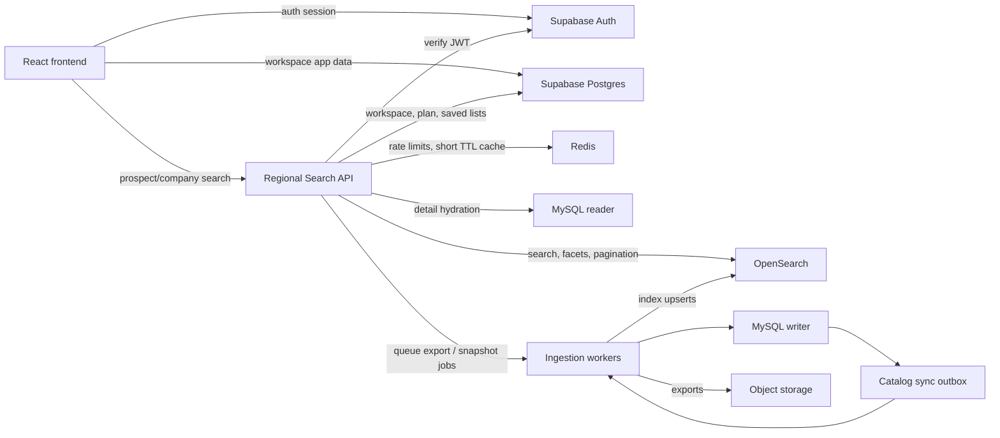
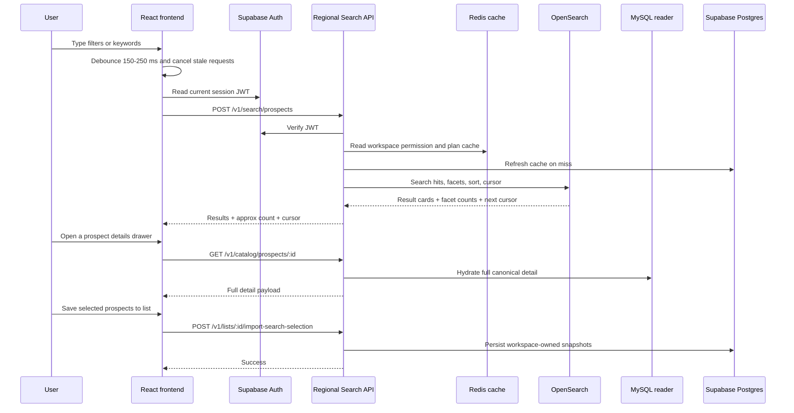
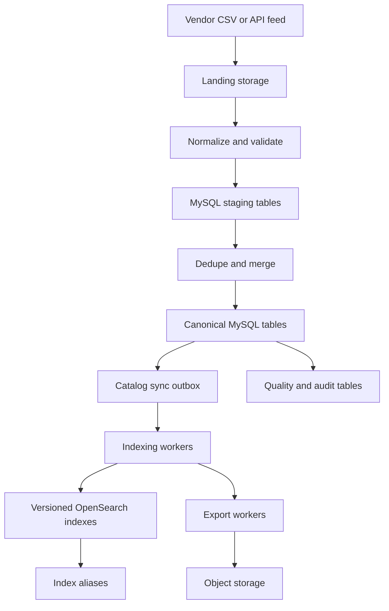

# Prospect Search Architecture

Last updated: March 19, 2026

## 1. Executive decision

Yes, this product can work very well with **Supabase + MySQL**, but only if each system has a strict job:

- **Supabase** stays the operational system for auth, workspaces, billing, campaigns, saved lists, automation state, and exports.
- **MySQL** becomes the canonical catalog for the shared prospect and company dataset.
- **OpenSearch** becomes the interactive search and filtering layer for person/company discovery.
- **A dedicated backend search API** sits between the React app and every data/search system.
- **Campaigns and saved lists use workspace-owned snapshots in Supabase**, not live reads from the global catalog.

If you try to make MySQL itself power Apollo-style interactive search across 8 million shared records, the user experience will degrade long before MySQL itself runs out of capacity.

The performance problem is not "8 million rows is too big for MySQL". The performance problem is using the wrong access pattern for those 8 million rows.

## 2. Final recommendation

### Recommended production stack

- **Frontend:** existing React/Vite app
- **Operational backend:** Supabase Auth + Supabase Postgres
- **Hot-path backend:** dedicated Node search service deployed in the same region as MySQL and OpenSearch
- **Canonical catalog:** managed MySQL 8.4 deployment
- **Search layer:** OpenSearch as the primary recommendation
- **Short-lived cache / queue coordination:** Redis
- **Background workers:** ingestion, indexing, exports, enrichment, quality jobs
- **Export storage:** object storage for CSV/XLSX delivery

### Why this is the right split

- MySQL is excellent for source-of-truth writes, dedupe, exact lookup, and controlled hydration.
- OpenSearch is better for faceting, ranking, cursor-based deep pagination, and interactive search UX.
- Supabase is already the right place for user/workspace/app state in this repo.
- A separate search API gives you one place for auth checks, quotas, suppression rules, save-to-list, and export orchestration.

## 3. Recommended choices

### Search engine

**Default recommendation: OpenSearch**

Use OpenSearch if you want:

- strong faceting and aggregations
- flexible ranking and boosting
- versioned indexes with alias-based reindexing
- point-in-time pagination with `search_after`
- room for more advanced search behavior later

**Alternative: Typesense**

Use Typesense if:

- the team is smaller
- you want lower operational complexity
- your ranking and faceting model will stay relatively controlled

For this product, my primary recommendation is still **OpenSearch**, because the roadmap naturally expands into saved searches, exports, advanced filters, ranking, company-first search, and analytics.

### Backend execution model

**Recommended:** dedicated Node service for prospect/company search.

Why:

- tighter control over MySQL connections and backpressure
- cleaner OpenSearch client lifecycle
- better control over regional placement
- easier async export and save-to-list orchestration
- easier to scale separately from the frontend and Supabase Edge Functions

**Use Supabase Edge Functions only for lightweight companion flows**, not as the main high-throughput search orchestrator.

Reason: Edge Functions are good for secure server-side logic, but this feature is dominated by data-plane locality. For the hot path, the best latency usually comes from keeping the search API beside the database and search cluster, not at the edge. That placement recommendation is an engineering inference from the system topology.

### MySQL deployment

**Preferred:** managed MySQL with high availability and reader support.

Examples:

- Aurora MySQL-compatible cluster, if you want the strongest managed option
- Amazon RDS MySQL Multi-AZ with one or more read replicas, if you want a simpler managed setup
- equivalent managed MySQL on another cloud, if AWS is not the target platform

I would not make this a self-managed VM MySQL server if the goal is SaaS production grade reliability.

## 4. Verified current repo state

The following points are verified from this codebase:

- The frontend uses `supabase-js` directly from the browser.
- [`src/components/ProspectListManager.tsx`](../src/components/ProspectListManager.tsx) reads and writes `prospects`, `email_lists`, and `email_list_prospects` directly through Supabase.
- [`supabase/migrations/20250614000000_bootstrap_core_tables.sql`](../supabase/migrations/20250614000000_bootstrap_core_tables.sql) creates `public.prospects` as a `user_id`-scoped operational table.
- [`supabase/migrations/20260309120000_add_workspace_team_management.sql`](../supabase/migrations/20260309120000_add_workspace_team_management.sql) adds workspace permission checks, but `public.prospects` policies still remain centered on `user_id`.

That means the current `public.prospects` table is still an operational contact store for:

- imported contacts
- saved list members
- webhook-created leads
- campaign and automation workflows

It is **not** the correct place for a shared 8 million row prospect marketplace.

## 5. Design goals

### Product goals

- instant-feeling person and company search
- stable saved lists and campaign audiences
- fast filters and pagination
- predictable exports
- clear separation between shared catalog data and workspace-owned operational data

### Performance goals

These are internal design targets, not guarantees:

| Interaction | Target |
| --- | --- |
| Autocomplete / lightweight suggestions | p95 under 250 ms user-perceived |
| Main search/filter refresh | p95 under 400 ms user-perceived |
| Open details drawer/profile | p95 under 300 ms |
| Save selected records to list | acknowledgement under 200 ms |
| Queue export job | under 2 seconds |

### System goals

- no live request should scan millions of MySQL rows
- no live request should join multiple large catalog tables for discovery
- ingestion and reindexing must not slow down search
- the app must degrade gracefully during partial outages
- the catalog search path must be region-local

## 6. Core principles

1. **Discovery is not the same thing as storage.**
   MySQL stores truth. OpenSearch handles interactive discovery.

2. **Search results should come from the search index, not from MySQL joins.**
   The index should already contain the fields needed to render result rows.

3. **MySQL should mostly serve exact lookups, hydration, dedupe, and worker-side processing.**

4. **Saved lists and campaigns must use snapshots.**
   Never let live catalog changes silently rewrite a running campaign audience.

5. **The hot path must be regional, not edge-scattered.**
   Put the search API, MySQL, OpenSearch, Redis, and workers close together.

6. **User experience should be two-speed.**
   Show fast approximate counts and results while the user is typing; do heavier exact work only when the query settles or the user explicitly saves/exports.

7. **Keep operational data and marketplace catalog data separate.**

## 7. Target topology

### Deployment notes

- Frontend can be globally cached.
- The search API, MySQL, OpenSearch, Redis, and workers should live in the same primary region.
- Supabase should be in the same region if possible, or at least region-close.
- Do not put the search API in one region and MySQL/OpenSearch in another.

## 8. Why this architecture is faster

### What the hot path does

For a normal search request:

1. user enters filters or keywords
2. React debounces the input and cancels stale in-flight requests
3. the search API verifies the Supabase JWT
4. the search API loads workspace plan/permission state, preferably through a short-lived cache
5. the search API queries OpenSearch
6. the API returns pre-shaped result cards, facets, and a cursor

### What the hot path does not do

- it does not run `LIKE '%term%'` against MySQL
- it does not join `companies`, `prospects`, `emails`, and `phones` live for every keystroke
- it does not deep-page with `OFFSET 100000`
- it does not read giant payloads from MySQL for list views

That is the core reason this feels fast.

## 9. Search request flow

## 10. Ingestion and indexing flow

### Important operational rule

Bulk imports, enrichment, reindexing, export generation, and QA jobs must stay off the request path. They must not compete directly with interactive search traffic.

## 11. Data ownership split

### Supabase Postgres keeps

- auth and JWT issuance
- workspaces, memberships, roles, permissions
- plans, quotas, billing state
- campaigns, sequences, sender accounts, automation state
- workspace saved lists
- workspace saved searches
- workspace-owned snapshots of selected catalog prospects
- export jobs, audit logs, suppression rules

### MySQL keeps

- canonical companies
- canonical prospects
- normalized contact points
- source records and provenance
- dedupe state
- quality / verification state
- sync outbox
- ingestion batches

### OpenSearch keeps

- denormalized search documents for people
- denormalized search documents for companies
- optional suggestion indexes for fast autocomplete

### Redis keeps

- short-lived permission and plan cache
- rate limit state
- lightweight coordination state

## 12. MySQL catalog design

### Canonical tables

Recommended core tables:

1. `companies`
2. `prospects`
3. `prospect_employment_current`
4. `prospect_emails`
5. `prospect_phones`
6. `prospect_addresses`
7. `prospect_source_records`
8. `ingest_batches`
9. `ingest_batch_rows`
10. `catalog_sync_outbox`
11. `catalog_quality_events`

### Optional but useful serving projection

Add a thin worker-owned projection such as `prospect_serving_projection` if you want a single MySQL row that assembles:

- canonical ids
- primary company relationship
- current title
- normalized geography
- freshness and QA scores
- export-safe display fields

This projection is not the primary search experience. It is a worker-side convenience layer for indexing, exports, and admin/debug use.

### Practical field mapping from your sample dataset

- identity: `first_name`, `last_name`, `contact_link`
- company: `company_name`, `domain`
- reachability: `email_address`, `email_status`, `phone_number`, `direct_number`
- role: `job_title`, `job_level`, `job_function`
- geography: `address_1`, `address_2`, `city`, `state`, `postal_code`, `country`, `region`
- company attributes: `industry_type`, `sub_industry`, `employee_size`, `revenue_size`, `naics_code`
- freshness and quality: `qa_status`, `qa_comments`, `data_status`, `database_date`, `audit_date`, `lead_age`
- provenance: `sr_no`, `campaign_id`, `client_code`, `msft_non_msft`, `lead_tagging`

### Additional fields I would add

- `person_identity_hash`
- `company_identity_hash`
- `email_normalized`
- `domain_normalized`
- `linkedin_normalized`
- `confidence_score`
- `source_priority`
- `last_verified_at`
- `catalog_version`
- `search_projection_updated_at`

## 13. MySQL table design rules

- use `BIGINT UNSIGNED` primary keys for catalog tables
- keep external source ids separate from internal ids
- keep hot rows narrow
- avoid large JSON blobs on hot tables
- store normalized fields explicitly or via generated columns
- keep wide audit/comment payloads out of the hot search-serving path
- use UTC timestamps consistently
- design indexes around exact access patterns, not around every imagined filter

## 14. MySQL indexing strategy

### The most important rule

Because OpenSearch is doing discovery, **MySQL does not need to carry every search filter as a live query index**.

That is a common mistake.

If you create too many large composite indexes to mimic search-engine behavior in MySQL, you will slow down ingest, updates, merges, and reindex preparation.

### MySQL indexes should optimize

- exact lookup by id
- exact or near-exact lookup by normalized email/domain/linkedin key
- company-to-prospect hydration
- dedupe matching
- outbox scanning
- export scans
- freshness scans

### Recommended index examples

#### `companies`

- `PRIMARY KEY (id)`
- `UNIQUE KEY uq_companies_domain (domain_normalized)`
- `KEY idx_companies_identity (company_identity_hash)`
- `KEY idx_companies_name_norm (name_normalized)`
- `KEY idx_companies_updated (updated_at, id)`

#### `prospects`

- `PRIMARY KEY (id)`
- `KEY idx_prospects_company (company_id, id)`
- `KEY idx_prospects_email_norm (email_normalized)`
- `KEY idx_prospects_email_domain (email_domain, id)`
- `KEY idx_prospects_linkedin_norm (linkedin_normalized)`
- `KEY idx_prospects_identity (person_identity_hash)`
- `KEY idx_prospects_updated (updated_at, id)`
- `KEY idx_prospects_verified (last_verified_at, id)`

#### `prospect_employment_current`

- `UNIQUE KEY uq_employment_current_prospect (prospect_id)`
- `KEY idx_employment_company_role (company_id, job_level, job_function, prospect_id)`

#### `prospect_source_records`

- `UNIQUE KEY uq_source_record (source_name, source_record_id)`
- `KEY idx_source_updated (updated_at, id)`

#### `catalog_sync_outbox`

- `KEY idx_outbox_status_time (sync_status, available_at, id)`
- `KEY idx_outbox_entity (entity_type, entity_id)`

### Generated or normalized columns worth having

- `full_name_normalized`
- `name_normalized`
- `job_title_normalized`
- `email_domain`
- `email_normalized`
- `domain_normalized`
- `linkedin_normalized`
- bucketed `employee_size`
- bucketed `revenue_size`

### Do not over-index on day one

At this scale, a smaller number of correct indexes is better than a large number of speculative ones.

Validate important MySQL queries with `EXPLAIN ANALYZE` and keep the slow query log on.

## 15. MySQL tuning priorities

If you are serious about performance, focus on these first:

1. **Buffer pool sizing**
   Keep the hot working set and hot indexes resident as much as possible.

2. **Fast storage**
   Use storage that can absorb indexing, staging loads, and read bursts.

3. **Read/write split**
   Keep the writer for ingestion and merges.
   Use one or more readers for detail hydration, exports, and admin workloads.

4. **Connection management**
   Use a managed proxy or disciplined pooling.
   Do not let many app instances fan out unbounded connections.

5. **Bulk ingest path**
   Load staging data in bulk.
   For large file ingestion, use MySQL's bulk load path instead of row-by-row inserts.

6. **Query validation**
   Every important MySQL query should be checked with `EXPLAIN ANALYZE`.

7. **Replica lag visibility**
   Detail hydration and exports should observe replica lag and fall back carefully if needed.

### What not to reach for first

- table partitioning
- dozens of composite indexes
- materializing every filter combination
- browser-driven direct SQL

For 8 million rows, those are usually not the first levers that matter.

## 16. Search index design

### Use separate indexes

I would not use one giant mixed people/company index.

Use:

- `prospects_current`
- `companies_current`
- optional `prospect_suggestions_current`
- optional `company_suggestions_current`

That gives you cleaner ranking and a better UI.

### Why separate person and company search matters

Users often search in two modes:

- "show me CFOs in healthcare companies in Texas"
- "show me companies in healthcare, then let me drill into people"

Those are related, but not the same ranking problem.

Separate indexes let you build a better product without forcing one index to do everything.

### Prospect search document

A prospect search document should contain enough data to fully render the search result row without going back to MySQL:

- `prospect_id`
- `company_id`
- `full_name`
- `first_name`
- `last_name`
- `headline`
- `job_title`
- `job_level`
- `job_function`
- `company_name`
- `company_domain`
- `city`
- `state`
- `country`
- `region`
- `industry_type`
- `sub_industry`
- `employee_size_bucket`
- `revenue_size_bucket`
- `email_status`
- `has_phone`
- `has_direct_number`
- `confidence_score`
- `last_verified_at`
- `database_date`
- `lead_age_bucket`
- `msft_non_msft`
- `linkedin_normalized`

### Company search document

Company search should have its own search document:

- `company_id`
- `company_name`
- `domain`
- `industry_type`
- `sub_industry`
- `country`
- `state`
- `employee_size_bucket`
- `revenue_size_bucket`
- `prospect_count`
- `executive_count`
- `last_catalog_update_at`
- `quality_score`

### Searchable fields

- person name
- company name
- company domain
- title/headline
- email
- city/state/country
- industry and sub-industry

### Filterable and facetable fields

- geography
- industry
- job level
- job function
- employee bucket
- revenue bucket
- email status
- QA status
- data status
- freshness bucket
- has phone
- has direct number
- workspace suppression eligibility

### Sortable fields

- relevance
- freshness
- confidence
- company size
- revenue size
- company name
- person name

## 17. Search pagination and count strategy

### Pagination

Do not use deep offset pagination.

Use:

- point-in-time search context
- `search_after`
- stable sort keys

That keeps deep navigation predictable and avoids the worst large-result pagination behavior.

### Counts

Use a two-speed model:

- while the user is typing, show fast approximate totals
- once the query settles, refresh exact or more precise counts if needed
- for very large exports, compute exact membership in the export job, not on every keystroke

This is one of the easiest ways to make the UI feel fast without lying to the user.

## 18. Search API surface

Recommended endpoints:

- `POST /v1/search/prospects`
- `POST /v1/search/companies`
- `GET /v1/catalog/prospects/:id`
- `GET /v1/catalog/companies/:id`
- `POST /v1/lists/:id/import-search-selection`
- `POST /v1/search/exports`
- `POST /v1/search/saved-searches`

### Responsibilities of the search API

- verify Supabase JWTs
- resolve workspace, permissions, and plan
- apply quotas and rate limits
- apply suppression rules
- query OpenSearch
- hydrate full detail from MySQL only when needed
- save snapshots to Supabase
- queue exports and background jobs

### Search API behavior rules

- return only light result cards for list pages
- return full details only for detail views
- cap page size aggressively
- never expose MySQL or search credentials to the browser
- enforce permissions server-side even if the UI already hides actions

## 19. Workspace snapshots

This is a critical product rule.

When a user saves prospects to a list or launches a campaign:

1. the user selects prospects from the shared search catalog
2. the backend writes workspace-owned snapshots into Supabase
3. campaigns read those snapshots, not the live global catalog

Every snapshot row should include:

- `workspace_id`
- `catalog_prospect_id`
- `catalog_company_id`
- saved display fields
- selected-at timestamp
- source query or saved-search id
- suppression state at save time
- search/index version if useful for auditability

That gives you:

- stable campaign membership
- clean auditability
- faster campaign execution
- safer behavior when the upstream catalog changes later

## 20. Frontend UX rules

To get the best user experience, the frontend should do all of the following:

- debounce search input by roughly 150-250 ms
- cancel stale requests aggressively
- keep previous results visible while loading the next response
- virtualize long result lists
- persist filters and cursor state in the URL
- prefetch the next page after idle when the user is clearly scrolling
- treat detail fetches separately from result-row fetches
- save selections optimistically once the API accepts the request

### Outside-the-box improvement that is worth it

Use separate flows for:

- **interactive discovery**
- **exact export membership**
- **campaign audience snapshots**

Many systems try to make one query path do all three. That usually makes all three worse.

## 21. Caching strategy

Use cache carefully.

### Good uses

- workspace permission and plan cache for 30-60 seconds
- hot facet metadata for short TTLs
- company lookup by domain/name for a few minutes
- saved search definitions

### Bad uses

- globally caching user search results without workspace and suppression scoping
- caching anything that can bypass permissions
- relying on cache for compliance correctness

The main performance win should come from architecture, not from trying to hide a bad design behind cache.

## 22. Export architecture

Large exports must be asynchronous.

Recommended flow:

1. user starts export
2. API validates permissions and quota
3. API creates export job row in Supabase
4. worker replays the search query or selection set
5. worker writes CSV/XLSX to object storage
6. frontend polls job state or receives completion notification

Do not make a normal user request wait while 10k or 100k rows are being assembled.

## 23. Failure and degradation plan

This is where production-grade systems are different from architecture notes.

### If OpenSearch is unhealthy

- fall back only to exact email/domain/id lookups
- disable broad keyword search temporarily
- show a clear UI banner
- do not slam MySQL with broad fallback queries

### If MySQL readers lag

- keep search working from the index
- delay detail hydration and exports if necessary
- route exact critical reads carefully

### If indexing lags behind the writer

- continue serving search
- surface freshness warnings where appropriate
- monitor `index_lag_seconds` and outbox depth

### If Supabase is degraded

- do not bypass auth or permission checks
- fail safely for save-to-list, saved searches, and exports

## 24. Observability and SLOs

Track at least:

- p50, p95, p99 search latency
- search error rate
- OpenSearch query latency and shard health
- outbox backlog
- indexing lag
- MySQL buffer pool hit behavior
- MySQL slow query count
- MySQL reader lag
- export queue depth
- save-to-list latency
- cache hit rate for workspace/plan lookups

If you do not track these, you will not know whether the system is actually getting faster.

## 25. What not to do

- do not put all 8 million catalog rows into `public.prospects`
- do not let the browser talk directly to MySQL
- do not expose search engine keys to the frontend
- do not use MySQL `LIKE '%term%'` for the main prospect UX
- do not build deep pagination with `OFFSET`
- do not join several large catalog tables on every search request
- do not use live catalog rows as campaign membership
- do not run ingestion and interactive search in the same worker/process pool
- do not place MySQL, OpenSearch, and the search API in different regions

## 26. What to change in this repo

### Keep as-is

- Supabase auth flow
- workspace and billing model
- existing operational contact flows for imported/user-owned data

### Add next

1. a dedicated regional search API service
2. MySQL canonical catalog schema
3. OpenSearch prospect and company indexes
4. workspace-scoped saved-search tables in Supabase
5. workspace snapshot tables for saved catalog selections
6. a new global prospect/company explorer UI separate from [`ProspectListManager`](../src/components/ProspectListManager.tsx)

### Important product split

Keep [`src/components/ProspectListManager.tsx`](../src/components/ProspectListManager.tsx) focused on workspace operational contacts and lists.

Build the global catalog experience as a separate feature surface.

That avoids mixing:

- user-owned operational contacts
- shared catalog search
- campaign recipient snapshots

## 27. Recommended rollout order

### Phase 1: foundation

- provision managed MySQL
- build canonical schema and staging tables
- add outbox table and indexing worker
- stand up the Node search API

### Phase 2: discovery

- create `prospects_current` and `companies_current` indexes
- build the new search UI
- add query, facet, and cursor flow
- keep detail hydration separate

### Phase 3: operational integration

- add workspace saved searches
- add save-to-list snapshot flow
- wire campaign builder to workspace snapshots where appropriate

### Phase 4: heavy workflows

- add export jobs
- add suppression layers
- add company-first drill-down
- add ranking and freshness tuning

### Phase 5: scale hardening

- add read replicas if not already present
- tune buffer pool and proxy limits
- add alias-based reindex flow
- add deeper observability and incident playbooks

## 28. Final answer

If you are going to use MySQL and you want the **best performance and best user experience**, the right architecture is:

- **Supabase for operational product data**
- **MySQL for canonical prospect/company storage**
- **OpenSearch for interactive discovery**
- **a dedicated regional Node search API in between**
- **workspace snapshots in Supabase for saved lists and campaigns**

That is the cleanest production-grade design for this codebase.

It gives you:

- fast search
- stable campaigns
- better scale isolation
- safer permissions
- cleaner future growth path

## 29. Official references

Official docs that support the implementation choices above:

- Supabase Edge Functions overview
  - https://supabase.com/docs/guides/functions
- Supabase Edge Functions auth
  - https://supabase.com/docs/guides/functions/auth
- Supabase Edge Functions limits
  - https://supabase.com/docs/guides/functions/limits
- MySQL InnoDB buffer pool
  - https://dev.mysql.com/doc/refman/8.4/en/innodb-buffer-pool.html
- MySQL multiple-column indexes
  - https://dev.mysql.com/doc/refman/8.4/en/multiple-column-indexes.html
- MySQL generated columns
  - https://dev.mysql.com/doc/refman/8.4/en/create-table-generated-columns.html
- MySQL `EXPLAIN` and `EXPLAIN ANALYZE`
  - https://dev.mysql.com/doc/refman/8.4/en/explain.html
- MySQL `LOAD DATA`
  - https://dev.mysql.com/doc/refman/8.4/en/load-data.html
- Amazon RDS MySQL read replicas
  - https://docs.aws.amazon.com/AmazonRDS/latest/UserGuide/USER_MySQL.Replication.ReadReplicas.html
- Amazon RDS Proxy
  - https://docs.aws.amazon.com/AmazonRDS/latest/UserGuide/rds-proxy.howitworks.html
- OpenSearch pagination and `search_after`
  - https://docs.opensearch.org/latest/search-plugins/searching-data/paginate/
- OpenSearch index aliases
  - https://docs.opensearch.org/latest/im-plugin/index-alias/
- Typesense search fundamentals
  - https://typesense.org/docs/30.0/api/search.html
- Typesense application design guide
  - https://typesense.org/docs/guide/building-a-search-application.html
